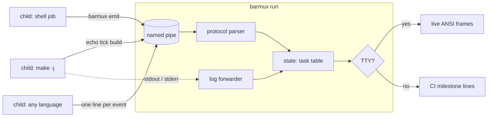

# barmux

[English](README.md) | [中文](README.zh.md) | [日本語](README.ja.md)

[](LICENSE) [](go.mod) [](CHANGELOG.md)  [](CONTRIBUTING.md)

**barmux：多プロセスのためのオープンソース進捗ダッシュボード——子プロセスはどの言語からでも「愚直な」パイププロトコルを書き、親プロセスが TTY ではライブなバーを、CI ではクリーンなマイルストーンログを描画する。**


```bash
git clone https://github.com/JaydenCJ/barmux && cd barmux
go build -o barmux ./cmd/barmux    # single static binary, stdlib only
```

> プレリリース：v0.1.0 はまだどのパッケージレジストリにも公開されていません。上記のとおりソースからビルドしてください（Go ≥1.22、Linux/macOS/BSD）。

## なぜ barmux？

`make -j8` や monorepo のビルドスクリプト、テストマトリクスを走らせると、並列ジョブ全員が同じ端末に出力します：スピナーの文字化けが交錯し、バーは描きかけ、`\r` は互いに潰し合う。優れた進捗ライブラリ——indicatif（Rust）、rich（Python）——は*単一プロセス内*ではこれを見事に解決しますが、ビルドは決して単一プロセスではありません：makefile がコンパイラを起動し、シェルスクリプトがジョブをバックグラウンドに回し、CI ランナーが 5 言語製のツールを呼び出す。それらが indicatif の `MultiProgress` を共有することはできません。barmux はダッシュボードをプロセスの*外*へ出します：親（`barmux run`）が端末と名前付きパイプを保持し、各子プロセス——シェルループ、Python スクリプト、コンパイララッパー——は `tick build` のような 1 行イベントを `$BARMUX_PIPE` に書くだけで進捗を報告できます。POSIX パイプは 512 バイト以下の書き込みの原子性を保証するため、並行ライターが何個いても互いを壊しません。TTY ではライブなマルチバー描画が得られ、出力がパイプされたときや CI では*同じ実行*が追記専用のクリーンなマイルストーン行に退避し、親がまったく居なくても計装済みスクリプトはそのまま動きます。

| | barmux | indicatif | rich.progress | GNU parallel --bar |
|---|---|---|---|---|
| 設計からしてクロスプロセス | ✅ パイププロトコル | ❌ 単一プロセス | ❌ 単一プロセス | ⚠️ 自前ジョブのみ |
| 子はどの言語でも | ✅ `echo` で十分 | ❌ Rust API | ❌ Python API | ⚠️ 引数リスト |
| 非 TTY / CI フォールバック | ✅ マイルストーン行 | ⚠️ 非表示か化ける | ⚠️ 注意が必要 | ❌ エスケープコード |
| レンダラー無しでも動く | ✅ 静かに no-op | ❌ | ❌ | ❌ |
| 進捗の録画と再生 | ✅ `render trace.log` | ❌ | ❌ | ❌ |
| ランタイム依存 | 0 | Rust crate 依存 | Python + 依存 | Perl |

<sub>依存数は 2026-07-13 に確認：barmux は Go 標準ライブラリのみを import。indicatif 0.17 は 5 crate、rich 13.x は 3 つの PyPI パッケージを取得。</sub>

## 特徴

- **Makefile の中から話せるプロトコル** — 1 行 1 イベント、クォート規則なし：`echo "start build 100 Compiling" > "$BARMUX_PIPE"`、あとは `tick build`。動詞は全部で 8 個、仕様は [docs/protocol.md](docs/protocol.md)。
- **行が千切れない並行性** — 512 バイトの行上限は POSIX `PIPE_BUF` に一致し、並行ライターが何個でも原子性を保つ。スモークテストは 4 つのサブシェルで 1 本のパイプを叩き、イベントを 1 つも落とさない。
- **CI フォールバック内蔵** — 非 TTY 出力は追記専用の `[id]  50% (2/4)` マイルストーン行（`--step` で調整可）に切り替わり、同じスクリプトが CI ログでは読みやすく、端末ではアニメーションする。
- **ゼロまで劣化できる** — ダッシュボードが聴いていないとき（パイプ不在、親の死亡、パイプ満杯）、`barmux emit` は静かに no-op：スクリプトへの計装が壊すことは決してない。
- **再生可能なトレース** — `BARMUX_PIPE` を通常ファイルに向ければ全イベントが記録される。`barmux render trace.log` でいつまでも再描画でき、`--frame` スナップショットも使える。
- **正直な終了コード** — 子の終了コードはそのまま伝播し、`fail` したタスクがあれば実行全体が 1 で終了、用法エラーは 2：スクリプトや pre-push フックに安心して包める。
- **依存ゼロ・完全オフライン** — Go 標準ライブラリのみ。ネットワークもテレメトリも一切なし。`NO_COLOR`、`--ascii`、`$COLUMNS` を尊重する。

## クイックスタート

```bash
barmux run -- sh -c '
  ( echo "start compile 4 Compiling objects" > "$BARMUX_PIPE"
    for f in main.c util.c net.c cli.c; do
      echo "msg compile cc src/$f" > "$BARMUX_PIPE"
      echo "tick compile"          > "$BARMUX_PIPE"
    done
    echo "done compile" > "$BARMUX_PIPE" ) &
  ( echo "start tests 8 Running tests" > "$BARMUX_PIPE"
    echo "tick tests 8"    > "$BARMUX_PIPE"
    echo "done tests" > "$BARMUX_PIPE" ) &
  wait'
```

TTY ではこれが 2 本のライブバーとして動きます。パイプ経由（この例）での実際にキャプチャした出力は次のとおり（2 つのジョブは並行に競走するため、交互の順序は実行ごとに変わり得ます）：

```text
[compile] start: Compiling objects (0/4)
[compile]  25% (1/4)  cc src/main.c
[compile]  50% (2/4)  cc src/util.c
[compile]  75% (3/4)  cc src/net.c
[compile] 100% (4/4)  cc src/cli.c
[compile] done (4/4)
[tests] start: Running tests (0/8)
[tests] 100% (8/8)
[tests] done (8/8)
2 tasks · 2 done · overall 100%
```

録画済みストリームを最終ダッシュボードのスナップショットとして再生（`barmux render --frame`、実際の出力）：

```text
✔ Compiling objects        ██████████████████████████████ 100% (24/24)  0:00
⠋ Running tests            ███████████████████░░░░░░░░░░░  63% (19/30)  0:00  pkg/api: TestRouter
⠋ Bundling assets          9 items  0:00
3 tasks · 2 running · 1 done · overall 80%
```

さらに動かせる素材は [examples/](examples/README.md) に：並列シェルビルドと、`barmux emit` を使った `make -j` 連携。

## パイププロトコル

セマンティクス（暗黙生成、クランプ、再開、寛容性）を含む完全仕様は [docs/protocol.md](docs/protocol.md)。

| 動詞 | 形式 | 意味 |
|---|---|---|
| `start` | `start <id> [<total>\|-] [label…]` | タスクを宣言；total ならバー、`-` ならスピナー |
| `tick` | `tick <id> [n]` | 進捗を n 進める（デフォルト 1） |
| `set` | `set <id> <current>` | 絶対値で進捗を設定 |
| `total` | `total <id> <n>` | 後から総量を設定・差し替え |
| `msg` | `msg <id> [text…]` | タスクのステータスメッセージを更新 |
| `done` | `done <id> [text…]` | 成功で終了（バーは 100% に到達） |
| `fail` | `fail <id> [text…]` | 失敗で終了、理由は任意 |
| `log` | `log [text…]` | パススルー行、バーの上に表示 |

## CLI リファレンス

`barmux [run|render|emit|version]` — 終了コード：0 成功、1 タスク失敗（または子自身のコード）、2 用法エラー、3 実行時エラー。

| フラグ | デフォルト | 効果 |
|---|---|---|
| `--width` | `$COLUMNS`、無ければ 80 | 端末幅（セル数） |
| `--no-color` | オフ | ANSI カラーを無効化（`NO_COLOR` も尊重） |
| `--ascii` | オフ | バー・スピナー・省略記号を ASCII のみに |
| `--step` | `10` | プレーンモードのマイルストーン間パーセント幅 |
| `--fps`（run） | `10` | TTY でのライブ再描画回数／秒 |
| `--pipe`（run） | 一時ディレクトリ | 指定パスにパイプを作成 |
| `--pipe`（emit） | `$BARMUX_PIPE` | 書き込み先のパイプまたはトレースファイル |
| `--check`（emit） | オフ | 誰も聴いていなければ no-op でなく 1 で終了 |
| `--frame`（render） | オフ | マイルストーンでなく最終フレームを 1 枚出力 |
| `--strict`（render） | オフ | 最初の不正行で 3 で終了 |
| `--quiet`（render） | オフ | マイルストーンを抑制；最終サマリーのみ |

0.1.0 の既知の制限：ラベル幅は rune 数で数えるため、東アジアの全角ラベルは切り詰めがやや遅れることがある。FIFO は POSIX プラットフォーム（Linux/macOS/BSD）が必要。

## 検証

このリポジトリは CI を同梱しません。上記の主張はすべてローカル実行で検証されます：

```bash
go test ./...            # 92 deterministic tests, offline, no sleeps, < 5 s
bash scripts/smoke.sh    # real pipe + concurrent writers end-to-end, prints SMOKE OK
```

## アーキテクチャ



## ロードマップ

- [x] v0.1.0 — パイププロトコル + `run`/`emit`/`render`、TTY ライブバー、CI フォールバック、再生可能トレース、92 テスト + スモークスクリプト
- [ ] `barmux serve`：複数の実行が順に接続できる常駐ダッシュボード
- [ ] タスクごとの ETA・速度推定（注入可能なクロックは実装済み）
- [ ] ラベルの東アジア全角幅のセル単位で正確な処理
- [ ] Windows 名前付きパイプのトランスポート
- [ ] ネストしたグループ（1 本のバーでタスクのサブツリーを要約）

全リストは [open issues](https://github.com/JaydenCJ/barmux/issues) を参照。

## コントリビュート

Issue・議論・PR を歓迎します——ローカルのワークフロー（フォーマット、vet、テスト、`SMOKE OK`）は [CONTRIBUTING.md](CONTRIBUTING.md) を参照。入門タスクは [good first issue](https://github.com/JaydenCJ/barmux/issues?q=is%3Aissue+is%3Aopen+label%3A%22good+first+issue%22) ラベル、設計の議論は [Discussions](https://github.com/JaydenCJ/barmux/discussions) へ。

## ライセンス

[MIT](LICENSE)
