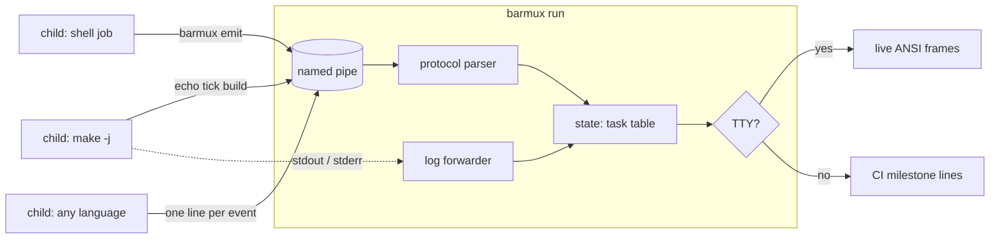

# barmux

[English](README.md) | [中文](README.zh.md) | [日本語](README.ja.md)

[](LICENSE) [](go.mod) [](CHANGELOG.md)  [](CONTRIBUTING.md)

**barmux：an open-source progress dashboard for many processes — children write a dumb pipe protocol from any language, one parent renders live bars on a TTY and clean milestone logs in CI.**


```bash
git clone https://github.com/JaydenCJ/barmux && cd barmux
go build -o barmux ./cmd/barmux    # single static binary, stdlib only
```

> Pre-release: v0.1.0 is not tagged on a package registry yet; build from source as above (any Go ≥1.22, Linux/macOS/BSD).

## Why barmux?

Run `make -j8`, a monorepo build script, or a test matrix, and every parallel job prints into the same terminal: interleaved spinner garbage, half-drawn bars, `\r` fights. The good progress libraries — indicatif (Rust), rich (Python) — solve this beautifully *inside one process*, but a build is never one process: it is a makefile spawning compilers, a shell script backgrounding jobs, a CI runner invoking tools written in five languages. None of them can share an indicatif `MultiProgress`. barmux moves the dashboard *out* of the process: the parent (`barmux run`) owns the terminal and a named pipe, and every child — shell loop, Python script, compiler wrapper — reports progress by writing one-line events like `tick build` to `$BARMUX_PIPE`. Lines under 512 bytes are atomic on POSIX pipes, so any number of concurrent writers never corrupt each other. On a TTY you get live multi-bar rendering; when output is piped or in CI, the *same run* degrades to clean, append-only milestone lines; with no parent listening at all, the instrumented script still runs unchanged.

| | barmux | indicatif | rich.progress | GNU parallel --bar |
|---|---|---|---|---|
| Cross-process by design | ✅ pipe protocol | ❌ single process | ❌ single process | ⚠️ own jobs only |
| Children in any language | ✅ `echo` is enough | ❌ Rust API | ❌ Python API | ⚠️ argument list |
| Non-TTY / CI fallback | ✅ milestone log lines | ⚠️ hidden or garbled | ⚠️ needs care | ❌ escape codes |
| Runs without the renderer | ✅ silent no-op | ❌ | ❌ | ❌ |
| Record and replay progress | ✅ `render trace.log` | ❌ | ❌ | ❌ |
| Runtime dependencies | 0 | Rust crate deps | Python + deps | Perl |

<sub>Dependency counts checked 2026-07-13: barmux imports the Go standard library only; indicatif 0.17 pulls 5 crates, rich 13.x pulls 3 PyPI packages.</sub>

## Features

- **A protocol you can speak from a Makefile** — one line per event, no quoting rules: `echo "start build 100 Compiling" > "$BARMUX_PIPE"`, then `tick build`. Eight verbs total, spec in [docs/protocol.md](docs/protocol.md).
- **Torn-line-proof concurrency** — the 512-byte line cap matches POSIX `PIPE_BUF`, so any number of parallel writers stay atomic; the smoke test hammers one pipe from four subshells and loses nothing.
- **CI fallback built in** — non-TTY output switches to append-only `[id]  50% (2/4)` milestone lines (configurable `--step`), so the same script is readable in CI logs and animated on your terminal.
- **Degrades to nothing** — `barmux emit` no-ops silently when no dashboard is listening (absent pipe, dead parent, full pipe): instrumenting a script never breaks it.
- **Replayable traces** — point `BARMUX_PIPE` at a regular file and every event is recorded; `barmux render trace.log` re-renders it forever, including `--frame` snapshots.
- **Honest exit codes** — child exit codes propagate, any `fail`ed task makes the run exit 1, usage errors exit 2: safe to wrap in scripts and pre-push hooks.
- **Zero dependencies, fully offline** — Go standard library only; no network, no telemetry, ever. `NO_COLOR`, `--ascii`, and `$COLUMNS` are honored.

## Quickstart

```bash
barmux run -- sh -c '
  ( echo "start compile 4 Compiling objects" > "$BARMUX_PIPE"
    for f in main.c util.c net.c cli.c; do
      echo "msg compile cc src/$f" > "$BARMUX_PIPE"
      echo "tick compile"          > "$BARMUX_PIPE"
    done
    echo "done compile" > "$BARMUX_PIPE" ) &
  ( echo "start tests 8 Running tests" > "$BARMUX_PIPE"
    echo "tick tests 8"    > "$BARMUX_PIPE"
    echo "done tests" > "$BARMUX_PIPE" ) &
  wait'
```

On a TTY this animates two live bars; piped (as here), the real captured output is (the two jobs race, so their interleaving can differ run to run):

```text
[compile] start: Compiling objects (0/4)
[compile]  25% (1/4)  cc src/main.c
[compile]  50% (2/4)  cc src/util.c
[compile]  75% (3/4)  cc src/net.c
[compile] 100% (4/4)  cc src/cli.c
[compile] done (4/4)
[tests] start: Running tests (0/8)
[tests] 100% (8/8)
[tests] done (8/8)
2 tasks · 2 done · overall 100%
```

Replay any recorded stream as a final dashboard snapshot (`barmux render --frame`, real output):

```text
✔ Compiling objects        ██████████████████████████████ 100% (24/24)  0:00
⠋ Running tests            ███████████████████░░░░░░░░░░░  63% (19/30)  0:00  pkg/api: TestRouter
⠋ Bundling assets          9 items  0:00
3 tasks · 2 running · 1 done · overall 80%
```

More runnable material in [examples/](examples/README.md): a parallel shell build and a `make -j` integration using `barmux emit`.

## The pipe protocol

Full spec with semantics (implicit creation, clamping, restarts, tolerance) in [docs/protocol.md](docs/protocol.md).

| Verb | Form | Meaning |
|---|---|---|
| `start` | `start <id> [<total>\|-] [label…]` | announce a task; total makes a bar, `-` a spinner |
| `tick` | `tick <id> [n]` | advance progress by n (default 1) |
| `set` | `set <id> <current>` | set absolute progress |
| `total` | `total <id> <n>` | set or replace the total after the fact |
| `msg` | `msg <id> [text…]` | update the task's status message |
| `done` | `done <id> [text…]` | finish successfully (bar snaps to 100%) |
| `fail` | `fail <id> [text…]` | finish as failed, with optional reason |
| `log` | `log [text…]` | pass-through line printed above the bars |

## CLI reference

`barmux [run|render|emit|version]` — exit codes: 0 ok, 1 task failed (or the child's own code), 2 usage error, 3 runtime error.

| Flag | Default | Effect |
|---|---|---|
| `--width` | `$COLUMNS`, else 80 | terminal width in cells |
| `--no-color` | off | disable ANSI colors (`NO_COLOR` also honored) |
| `--ascii` | off | ASCII-only bars, spinners, and ellipses |
| `--step` | `10` | percent step between plain-mode milestones |
| `--fps` (run) | `10` | live repaints per second on a TTY |
| `--pipe` (run) | temp dir | create the pipe at an explicit path |
| `--pipe` (emit) | `$BARMUX_PIPE` | pipe or trace file to write to |
| `--check` (emit) | off | exit 1 instead of no-op when nobody listens |
| `--frame` (render) | off | print one final dashboard frame, not milestones |
| `--strict` (render) | off | exit 3 on the first malformed line |
| `--quiet` (render) | off | suppress milestones; only the final summary |

Known limitation in 0.1.0: label widths are counted in runes, so East-Asian double-width labels may truncate a little late; FIFOs require a POSIX platform (Linux/macOS/BSD).

## Verification

This repository ships no CI; every claim above is verified by local runs:

```bash
go test ./...            # 92 deterministic tests, offline, no sleeps, < 5 s
bash scripts/smoke.sh    # real pipe + concurrent writers end-to-end, prints SMOKE OK
```

## Architecture



## Roadmap

- [x] v0.1.0 — pipe protocol + `run`/`emit`/`render`, live TTY bars, CI fallback, replayable traces, 92 tests + smoke script
- [ ] `barmux serve` for a long-lived dashboard multiple runs attach to
- [ ] ETA and rate estimation per task (injectable clock is already in place)
- [ ] Cell-accurate East-Asian width handling for labels
- [ ] Windows named-pipe transport
- [ ] Nested groups (one bar summarizing a subtree of tasks)

See the [open issues](https://github.com/JaydenCJ/barmux/issues) for the full list.

## Contributing

Issues, discussions and pull requests are welcome — see [CONTRIBUTING.md](CONTRIBUTING.md) for the local workflow (format, vet, tests, `SMOKE OK`). Good entry points are labelled [good first issue](https://github.com/JaydenCJ/barmux/issues?q=is%3Aissue+is%3Aopen+label%3A%22good+first+issue%22), and design questions live in [Discussions](https://github.com/JaydenCJ/barmux/discussions).

## License

[MIT](LICENSE)
