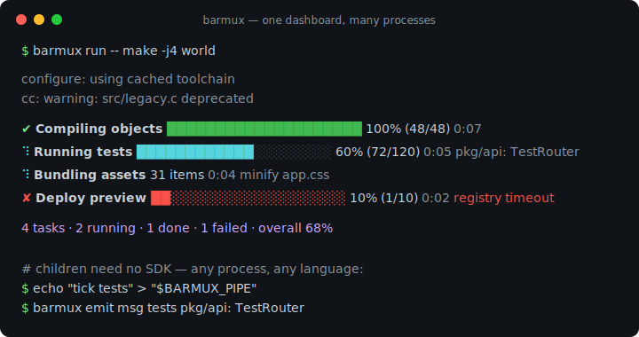
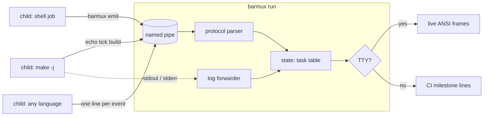

# barmux

[English](README.md) | [中文](README.zh.md) | [日本語](README.ja.md)

[](LICENSE) [](go.mod) [](CHANGELOG.md)  [](CONTRIBUTING.md)

**barmux：面向多进程的开源进度仪表盘——子进程用任何语言写一个"笨"管道协议，父进程在 TTY 上渲染实时进度条，在 CI 里输出干净的里程碑日志。**



```bash
git clone https://github.com/JaydenCJ/barmux && cd barmux
go build -o barmux ./cmd/barmux    # single static binary, stdlib only
```

> 预发布说明：v0.1.0 尚未发布到任何包仓库；请按上述方式从源码构建（任意 Go ≥1.22，Linux/macOS/BSD）。

## 为什么选 barmux？

跑一次 `make -j8`、monorepo 构建脚本或测试矩阵，每个并行任务都往同一个终端里打印：转轮乱码互相穿插、进度条画一半、`\r` 互相打架。优秀的进度库——indicatif（Rust）、rich（Python）——在*单个进程内*把这件事解决得很漂亮，但构建从来不是单个进程：它是 makefile 派生编译器、shell 脚本把任务放到后台、CI runner 调用五种语言写的工具。它们没法共享一个 indicatif 的 `MultiProgress`。barmux 把仪表盘挪到进程*外面*：父进程（`barmux run`）持有终端和一个命名管道，每个子进程——shell 循环、Python 脚本、编译器包装——只需向 `$BARMUX_PIPE` 写入 `tick build` 这样的单行事件即可上报进度。POSIX 管道对 512 字节以内的写入保证原子性，任意数量的并发写入者都不会互相破坏。在 TTY 上你得到实时多条进度条；当输出被管道重定向或在 CI 中时，*同一次运行*退化为干净的、只追加的里程碑行；完全没有父进程监听时，被插桩的脚本也照常运行。

| | barmux | indicatif | rich.progress | GNU parallel --bar |
|---|---|---|---|---|
| 天生跨进程 | ✅ 管道协议 | ❌ 单进程 | ❌ 单进程 | ⚠️ 仅自己的 job |
| 子进程可用任何语言 | ✅ `echo` 就够 | ❌ Rust API | ❌ Python API | ⚠️ 参数列表 |
| 非 TTY / CI 回退 | ✅ 里程碑日志行 | ⚠️ 隐藏或乱码 | ⚠️ 需要小心 | ❌ 转义码 |
| 没有渲染端也能跑 | ✅ 静默 no-op | ❌ | ❌ | ❌ |
| 进度可录制回放 | ✅ `render trace.log` | ❌ | ❌ | ❌ |
| 运行时依赖 | 0 | Rust crate 依赖 | Python + 依赖 | Perl |

<sub>依赖数核对于 2026-07-13：barmux 只 import Go 标准库；indicatif 0.17 拉取 5 个 crate，rich 13.x 拉取 3 个 PyPI 包。</sub>

## 特性

- **在 Makefile 里就能说的协议** — 一行一个事件，没有任何引号规则：`echo "start build 100 Compiling" > "$BARMUX_PIPE"`，然后 `tick build`。总共八个动词，规范见 [docs/protocol.md](docs/protocol.md)。
- **并发不撕行** — 512 字节行上限对齐 POSIX `PIPE_BUF`，任意数量并行写入者保持原子；冒烟测试用四个子 shell 猛写同一根管道，一个事件都不丢。
- **内置 CI 回退** — 非 TTY 输出切换为只追加的 `[id]  50% (2/4)` 里程碑行（`--step` 可调），同一个脚本在 CI 日志里可读、在你的终端上有动画。
- **可以退化到零** — 没有仪表盘监听时（管道不存在、父进程死了、管道写满），`barmux emit` 静默 no-op：给脚本插桩永远不会弄坏它。
- **可回放的 trace** — 把 `BARMUX_PIPE` 指向普通文件即可录下全部事件；`barmux render trace.log` 可以永久重渲染，还支持 `--frame` 快照。
- **诚实的退出码** — 子进程退出码原样透传，任何 `fail` 的任务让整次运行退出 1，用法错误退出 2：可以放心包进脚本和 pre-push 钩子。
- **零依赖、完全离线** — 只用 Go 标准库；永不联网、永无遥测。支持 `NO_COLOR`、`--ascii` 和 `$COLUMNS`。

## 快速上手

```bash
barmux run -- sh -c '
  ( echo "start compile 4 Compiling objects" > "$BARMUX_PIPE"
    for f in main.c util.c net.c cli.c; do
      echo "msg compile cc src/$f" > "$BARMUX_PIPE"
      echo "tick compile"          > "$BARMUX_PIPE"
    done
    echo "done compile" > "$BARMUX_PIPE" ) &
  ( echo "start tests 8 Running tests" > "$BARMUX_PIPE"
    echo "tick tests 8"    > "$BARMUX_PIPE"
    echo "done tests" > "$BARMUX_PIPE" ) &
  wait'
```

在 TTY 上这是两条实时进度条；被管道重定向时（如此处），真实捕获的输出如下（两个任务并发竞争，交错顺序每次运行可能不同）：

```text
[compile] start: Compiling objects (0/4)
[compile]  25% (1/4)  cc src/main.c
[compile]  50% (2/4)  cc src/util.c
[compile]  75% (3/4)  cc src/net.c
[compile] 100% (4/4)  cc src/cli.c
[compile] done (4/4)
[tests] start: Running tests (0/8)
[tests] 100% (8/8)
[tests] done (8/8)
2 tasks · 2 done · overall 100%
```

把任意录制好的流重放为最终仪表盘快照（`barmux render --frame`，真实输出）：

```text
✔ Compiling objects        ██████████████████████████████ 100% (24/24)  0:00
⠋ Running tests            ███████████████████░░░░░░░░░░░  63% (19/30)  0:00  pkg/api: TestRouter
⠋ Bundling assets          9 items  0:00
3 tasks · 2 running · 1 done · overall 80%
```

更多可运行的材料见 [examples/](examples/README.md)：一个并行 shell 构建和一个用 `barmux emit` 的 `make -j` 集成。

## 管道协议

完整规范及语义（隐式创建、钳位、重启、容错）见 [docs/protocol.md](docs/protocol.md)。

| 动词 | 形式 | 含义 |
|---|---|---|
| `start` | `start <id> [<total>\|-] [label…]` | 声明一个任务；total 画进度条，`-` 画转轮 |
| `tick` | `tick <id> [n]` | 进度前进 n（默认 1） |
| `set` | `set <id> <current>` | 设置绝对进度 |
| `total` | `total <id> <n>` | 事后设置或替换总量 |
| `msg` | `msg <id> [text…]` | 更新任务的状态消息 |
| `done` | `done <id> [text…]` | 成功结束（进度条直接到 100%） |
| `fail` | `fail <id> [text…]` | 以失败结束，可附原因 |
| `log` | `log [text…]` | 透传行，打印在进度条上方 |

## CLI 参考

`barmux [run|render|emit|version]` — 退出码：0 成功，1 有任务失败（或子进程自己的退出码），2 用法错误，3 运行时错误。

| 标志 | 默认值 | 效果 |
|---|---|---|
| `--width` | `$COLUMNS`，否则 80 | 终端宽度（单元格数） |
| `--no-color` | 关 | 禁用 ANSI 颜色（也遵守 `NO_COLOR`） |
| `--ascii` | 关 | 纯 ASCII 的进度条、转轮和省略号 |
| `--step` | `10` | 纯文本模式里程碑之间的百分比步长 |
| `--fps`（run） | `10` | TTY 上每秒实时重绘次数 |
| `--pipe`（run） | 临时目录 | 在指定路径创建管道 |
| `--pipe`（emit） | `$BARMUX_PIPE` | 要写入的管道或 trace 文件 |
| `--check`（emit） | 关 | 无人监听时退出 1 而不是 no-op |
| `--frame`（render） | 关 | 打印一帧最终仪表盘而非里程碑流 |
| `--strict`（render） | 关 | 遇到第一条畸形行即退出 3 |
| `--quiet`（render） | 关 | 抑制里程碑；只输出最终汇总 |

0.1.0 的已知限制：标签宽度按 rune 计数，东亚全角标签可能截断得略晚；FIFO 需要 POSIX 平台（Linux/macOS/BSD）。

## 验证

本仓库不附带 CI；以上所有断言都由本地运行验证：

```bash
go test ./...            # 92 deterministic tests, offline, no sleeps, < 5 s
bash scripts/smoke.sh    # real pipe + concurrent writers end-to-end, prints SMOKE OK
```

## 架构



## 路线图

- [x] v0.1.0 — 管道协议 + `run`/`emit`/`render`、TTY 实时进度条、CI 回退、可回放 trace、92 个测试 + 冒烟脚本
- [ ] `barmux serve`：常驻仪表盘，多次运行可先后接入
- [ ] 按任务的 ETA 和速率估算（可注入时钟已就位）
- [ ] 标签的东亚全角宽度精确处理
- [ ] Windows 命名管道传输
- [ ] 嵌套分组（一条进度条汇总一棵任务子树）

完整列表见 [open issues](https://github.com/JaydenCJ/barmux/issues)。

## 贡献

欢迎 issue、讨论与 PR——本地工作流（格式化、vet、测试、`SMOKE OK`）见 [CONTRIBUTING.md](CONTRIBUTING.md)。入门任务见 [good first issue](https://github.com/JaydenCJ/barmux/issues?q=is%3Aissue+is%3Aopen+label%3A%22good+first+issue%22) 标签，设计讨论在 [Discussions](https://github.com/JaydenCJ/barmux/discussions)。

## 许可证

[MIT](LICENSE)
